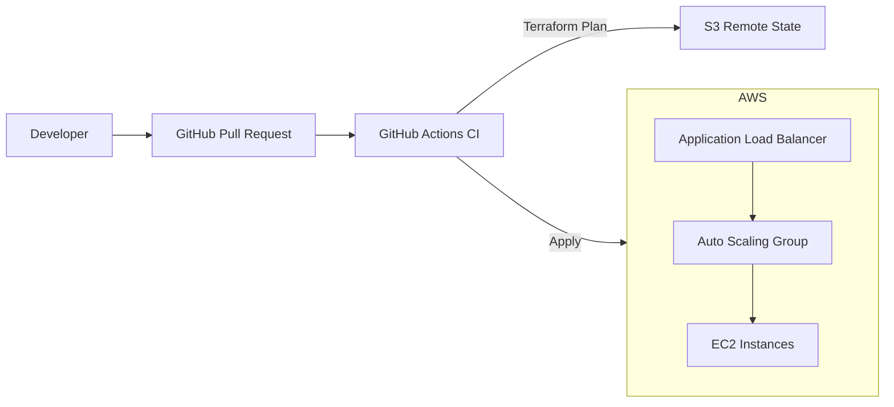

# AWS Infrastructure CI/CD with Terraform

Production-ready **multi-environment AWS infrastructure** automated using **Terraform** and **GitHub Actions**.  
This project demonstrates real-world Infrastructure as Code (IaC), CI/CD automation, and production safety controls.

---

## 🚀 Overview

This repository provisions AWS infrastructure across **dev**, **test**, and **prod** using a single Terraform codebase.

**Key goals**
- Eliminate manual infrastructure changes
- Isolate environments safely
- Enforce plan-before-apply workflows
- Protect production with approval gates

---

## 🏗️ Architecture

### High-Level Design
- One VPC per environment
- Public subnets for ALB
- Private subnets for EC2
- Auto Scaling across multiple AZs
- Remote Terraform state in S3
- CI/CD-driven deployments

  --- 

### Architecture Diagram

--- 

### 🧰 Tech Stack
- IaC: Terraform (workspaces, remote state)
- Cloud: AWS (VPC, EC2, ALB, Auto Scaling, S3, CloudWatch)
- CI/CD: GitHub Actions
- Security: Trivy, TFLint
- OS: Linux (Ubuntu)
- Version Control: Git, GitHub

--- 
### 🔁 CI/CD Workflow
#### On Pull Request
- Terraform fmt & validate
- TFLint linting
- Trivy security scan
- Terraform plan posted to PR
  
#### On Merge
- Workspace selection
- Terraform apply
- Manual approval required for prod
